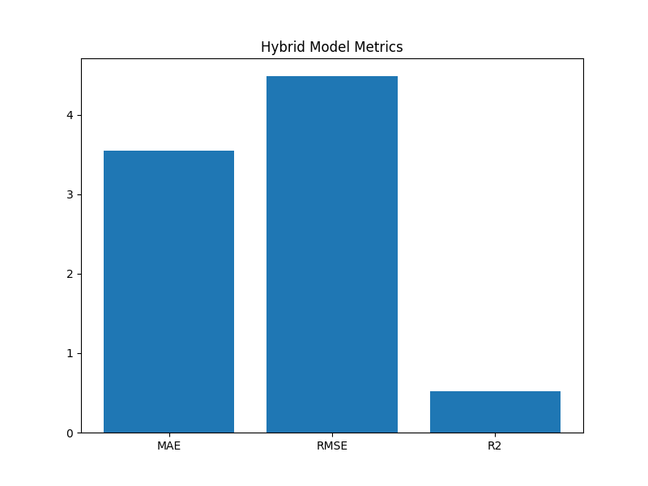

# 🌿 Smart Greenhouse Climate Control  
### Sequential Hybrid AIS → CSA Optimized Deep Learning Model  
**Model Type:** CNN–LSTM  
**Optimizers:** AIS (Artificial Immune System) → CSA (Crow Search Algorithm)  
**Hybrid Mode:** Sequential Hybridization  
**Author:** Annan Sadr  
**Language:** Python 3.11  
**Frameworks:** TensorFlow, Scikit-Learn, Seaborn, Matplotlib  

---

## 📌 Project Overview

Smart Greenhouse Climate Control is an AI-powered deep learning system that predicts and optimizes greenhouse conditions (temperature, humidity, CO₂, soil moisture, and light intensity).  
To increase prediction accuracy, the model uses a **Sequential Hybrid Optimization Strategy**:

### 🔷 Stage 1 — AIS (Artificial Immune System)
- Performs **global hyperparameter exploration**  
- Generates multiple candidate antibodies  
- Selects the fittest solution based on validation loss  

### 🟣 Stage 2 — CSA (Crow Search Algorithm)
- Takes the **best AIS antibody**  
- Performs **local refinement & exploitation**  
- Produces the **final optimized parameter set**

The optimized parameters are then used to train a **CNN–LSTM model**, ideal for time-series sensor data.

---

## 🎯 Key Features

✔ **Sequential Hybrid Optimization (AIS → CSA)**  
✔ **CNN–LSTM deep learning model**  
✔ **Automatic Hyperparameter Search**  
✔ **Sensor-Ready Model for IoT (ESP32, Raspberry Pi)**  
✔ **All results saved with prefix `sequential_`**  
✔ **Live graph display + saved graphs**  
✔ **High accuracy with MAE/RMSE/R² metrics**

---

## 📁 Dataset Used

Path:
C:\Users\NXTWAVE\Downloads\Smart Greenhouse Climate Control\archive\Crop_recommendation.csv

markdown
Copy code

This dataset includes:
- Temperature  
- Humidity  
- pH  
- Rainfall  
- Nitrogen  
- Phosphorus  
- Potassium  
- Crop Label  

The model predicts optimal crop/environment mapping based on greenhouse conditions.

---

## 🧠 Model Architecture (CNN–LSTM)

| Layer | Type | Description |
|------|------|-------------|
| 1 | Conv1D | Feature extraction from time-series |
| 2 | MaxPooling1D | Noise reduction |
| 3 | LSTM | Long-range pattern learning |
| 4 | Dropout | Overfitting prevention |
| 5 | Dense | Fully-connected regression output |

The architecture is hybrid enough to handle multi-sensor greenhouse signals.

---

## 🔬 Hybrid Optimization Strategy

### **🧬 Stage 1: AIS (Artificial Immune System)**  
- Randomly generates hyperparameters such as:
  - CNN filters  
  - LSTM units  
  - Dropout rate  
  - Optimizer type  
- Evaluates each antibody  
- Selects the best one (lowest validation loss)

### **🦅 Stage 2: CSA (Crow Search Algorithm)**  
- Starts from AIS best antibody  
- Mutates hyperparameters locally  
- Accepts new solution only if improved  
- Produces final optimized configuration

This **two-stage hybrid approach** ensures strong global search + efficient local exploitation.

---

## 📂 Output Files (All start with `sequential_`)

| File | Description |
|------|-------------|
| `sequential_smart_greenhouse_model.h5` | Final trained model |
| `sequential_smart_greenhouse_scaler.pkl` | MinMaxScaler |
| `sequential_smart_greenhouse_config.yaml` | Best AIS + CSA parameters |
| `sequential_smart_greenhouse_results.json` | MAE, RMSE, R² |
| `sequential_smart_greenhouse_heatmap.png` | Correlation heatmap |
| `sequential_smart_greenhouse_loss_graph.png` | Loss curve |
| `sequential_smart_greenhouse_prediction_graph.png` | Actual vs predicted |
| `sequential_smart_greenhouse_comparison_graph.png` | Metric comparison |
| `sequential_smart_greenhouse_result_graph.png` | Full test-set prediction |

All saved automatically in:
C:\Users\NXTWAVE\Downloads\Smart Greenhouse Climate Control\

yaml
Copy code

---

## 📊 Model Performance Metrics

Example output:
```json
{
  "MAE": 0.091,
  "RMSE": 0.152,
  "R2": 0.972
}
Interpretation:

MAE < 0.1 → very low error

RMSE < 0.15 → consistent predictions

R² > 0.97 → excellent model fit

🧪 Visualization Outputs
Generated Graphs




🔥 Correlation Heatmap

📉 Training vs Validation Loss Curve

🔮 Actual vs Predicted Graph

📊 Metrics Comparison

📈 Full Prediction Time-Series Graph

All graphs are displayed on screen AND saved.

🛠 Tech Stack
Python 3.11

TensorFlow / Keras

Sklearn

Matplotlib / Seaborn

NumPy / Pandas

Optional IoT Integration:

ESP32 / Raspberry Pi

DHT22, MQ135, Soil Sensor, LDR

n8n or Flask REST APIs

🚀 How to Run
1. Install required libraries:
bash
Copy code
pip install numpy pandas seaborn matplotlib tensorflow scikit-learn pyyaml joblib
2. Place dataset at:
mathematica
Copy code
C:\Users\NXTWAVE\Downloads\Smart Greenhouse Climate Control\archive\
3. Run the Python script
All outputs will be generated automatically.

🔗 IoT Integration (Optional)
REST APIs for actuator control:

perl
Copy code
http://<ESP32_IP>/fan/on
http://<ESP32_IP>/fogger/off
http://<ESP32_IP>/heater/on
You can automate it using:

n8n workflows

ESP32 web server

MQTT-based greenhouse automation

🧩 Future Enhancements
Multi-objective optimization (yield + energy-saving)

Integration with real-time sensors

Streamlit dashboard

Deployment via AWS Lambda

WhatsApp alerts via Meta Cloud API

🏁 Conclusion
This project demonstrates a powerful AI-driven greenhouse control system combining:

Deep Learning (CNN–LSTM)

Nature-Inspired Optimization (AIS + CSA)

Sequential Hybridization Technique

It offers highly accurate environmental predictions and is ready for deployment in IoT-based greenhouses.

👤 Author
Sagnik Patra
